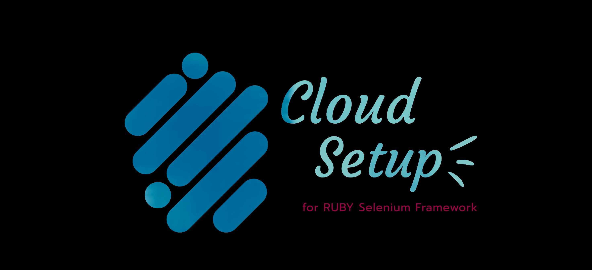

# Cloud Automation Setup
Complete setup to run UI Automation in cloud.



To run web automation suites in the Jenkins, we need to ensure that the following items are preinstalled in the Linux & Jenkins server.

1. Need to have Lanugage specific requirements or specific docker images.
2. Need to have the required browsers in which automation suites are going to run. (eg., Chrome, Firefox, etc.,)
3. Need to have (Selenium) Drivers corresponding to the browsers. (When Selenium 4.0+ is released this drivers is need not to be installed separately, since it will have internal driver manager.)
4. Each Jenkins slave (where UI automation is running) should have minimum 2GB ram and minimum 2 core processor with 1.2GHZ processor.
5. Allure plugin to be added in Jenkins (For reporting purpose)


Installation Procedures: (may change over a period of time)


## Language specfic requirements

### Ruby:

Install latest version of ruby in the linux machine from **[here](https://www.ruby-lang.org/en/documentation/installation/)** and then try installing bundler gem
```
gem install bundler
```
Once that is done, Install the RVM manager from [here](https://rvm.io/rvm/install)

**(or)**

Get the docker image which is ruby friendly. [Sample docker image](https://hub.docker.com/_/ruby)


### Python:

Install the latest version of python in the linux machine from **[here](https://docs.python-guide.org/starting/install3/linux/)** and then install the pip package.

**(or)**

Get the docker image which is python friendly. [Sample docker image](https://hub.docker.com/_/python)


## Browsers:

### Chrome Installation:
The following will install latest chrome in linux
```
sudo apt-get install google-chrome-stable
```

### Uninstall Chrome:
```
sudo apt-get purge google-chrome-stable
rm ~/.config/google-chrome/ -rf
```

### Install Chrome with specific version:
```
wget https://repo.aosc.io/debs/pool/stable/main/g/google-chrome_78.0.3904.70-0_amd64.deb # URL to download the deb file
sudo dpkg -i google-chrome_78.0.3904.70-0_amd64.deb # name of the downloaded deb file
sudo apt-get -f install # To resolve the installation with dependencies
```


## Browser Drivers:

### Install Chrome driver:
```
version=$(curl -s https://chromedriver.storage.googleapis.com/LATEST_RELEASE)
wget -qP "/tmp/" "https://chromedriver.storage.googleapis.com/${version}/chromedriver_linux64.zip"
sudo unzip -o /tmp/chromedriver_linux64.zip -d /home/ubuntu/.rvm/gems/ruby-2.5.1/wrappers/chromedriver # in which ever location you want
sudo chmod 755 /usr/bin/chromedriver
sudo chown root:root /usr/bin/chromedriver
sudo chmod +x /usr/bin/chromedriver
```

### Uninstalling chrome driver:
```
find / -name "chromedriver"
sudo rm -rf /usr/bin/chromedriver # remove all the paths listed in the above command
chromedriver -v # should not give any versions
```


## Allure for jenkins:

https://www.wedoqa.com/2017/11/allure-integration-in-jenkins/


## Plugins for Jenkins

https://wiki.jenkins.io/display/JENKINS/Rebuild+Plugin

https://jenkins.io/doc/pipeline/steps/allure-jenkins-plugin/

## In the shell prompt in jenkins

### For ruby

Add the following to use the ruby in shell prompt and then run.
```
#!/bin/bash -l
rvm list
ls
cd <path_to_the_project>
cucumber #or custom commands
```

### For Python

Add the following to use the python from the shell prompt and then run.
```
#!/usr/bin/python3
python --version
cd <path_to_the_project>
pip3 install -r requirements.txt
headless=1 pytest -s -v -n 4
```

## In Jenkins allure plugin configuration

In the results path give `**/<path_to_your_allure_generated_folder>/` path to the allure.
Set the report path and allure configuration as `allure-report`.

## Jenkins pipline

### For Ruby
To integrate with jenkins pipeline use the following code.
```
pipeline {
  agent { docker { image 'ruby:2.6.1' } }
  stages {
    stage('requirements') {
      steps {
        sh 'gem install bundler -v 2.0.1'
      }
    }
    stage('build') {
      steps {
        sh 'bundle install'
      }
    }
    stage('test') {
      steps {
        sh 'cucumber ...' # or custom methods 
      }   
    }
  }
}
```

### For Python
```
pipeline {
  agent { docker { image 'python:3.7.6' } }
  stages {
    stage('requirements') {
      steps {
        sh 'pip install -r requirements.txt'
      }
    }
    stage('build') {
      steps {
        sh '# python build command'
      }
    }
    stage('test') {
      steps {
        sh 'pytest ...' # or custom methods 
      }   
    }
  }
}
```
